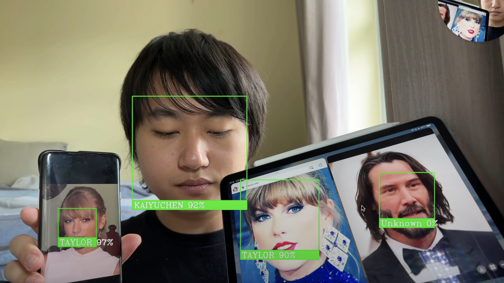

# Live Streaming Service - Facial Recognition Server 

Kaiyu Chen - 20100199  

## Usage:

Install the required packages
 
```shell
pip3 install -r requirements.txt
```
or using

```shell
pip install -r requirements.txt
```

Run the server script

```shell
python3 server.py
```
or using

```shell
python server.py
```

Once the server is running, you can access the web page by typing the following address in your browser  

```
http://localhost:8080/
http://YourIP:8080/
```

## Demo
[Youtube](https://youtu.be/BthK6aZOvSQ)

## Environment
macOS Ventura 13.3.1  
Python 3.9.16  

## Little Tips
I encountered some errors when configuring my environment, and you may encounter these problems as well. You may be able to try to resolve the problem by using these commands
```shell
pip3 install --upgrade pip
python3 -m pip install --upgrade setuptools
```

## Detailed Documentation
[Documentation](docs/Continuous%20Assessment%20Report.pdf)

## Application Preview  
